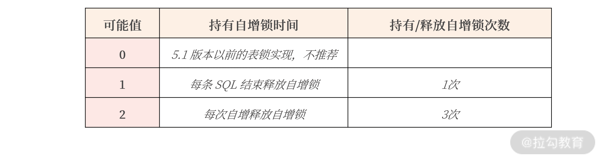

mysql 数据库实战宝典。

<!--more-->

不推荐使用整型类型的属性 Unsigned，若非要使用，参数 sql_mode 务必额外添加上选项 NO_UNSIGNED_SUBTRACTION；

用自增整型做主键，一律使用 BIGINT，而不是 INT。

在海量互联网业务的设计标准中，并不推荐用 DECIMAL 类型，而是更推荐将 DECIMAL 转化为 整型类型

所以在 MySQL 数据库下，绝大部分场景使用类型 VARCHAR 就足够了。

推荐把 MySQL 的默认字符集设置为 UTF8MB4

```Shell
CREATE TABLE User (
    id BIGINT NOT NULL AUTO_INCREMENT,
    name VARCHAR(255) NOT NULL,
    sex CHAR(1) NOT NULL,
    password VARCHAR(1024) NOT NULL,
    regDate DATETIME NOT NULL,
    CHECK (sex = 'M' OR sex = 'F'),
    PRIMARY KEY(id)
);
```

总的来说，我建议你使用类型 DATETIME。 对于时区问题，可以由前端或者服务这里做一次转化，不一定非要在数据库中解决。

在做表结构设计规范时，强烈建议你每张业务核心表都增加一个 DATETIME 类型的 last_modify_date 字段，并设置修改自动更新机制， 即便标识每条记录最后修改的时间。

```Shell
CREATE TABLE User (
    id BIGINT NOT NULL AUTO_INCREMENT,
    name VARCHAR(255) NOT NULL,
    sex CHAR(1) NOT NULL,
    password VARCHAR(1024) NOT NULL,
    money INT NOT NULL DEFAULT 0,
    register_date DATETIME(6) NOT NULL DEFAULT CURRENT_TIMESTAMP(6),
    last_modify_date DATETIME(6) NOT NULL DEFAULT CURRENT_TIMESTAMP(6) ON UPDATE CURRENT_TIMESTAMP(6),
    CHECK (sex = 'M' OR sex = 'F'),
    PRIMARY KEY(id)
);
```

JSON 类型是 MySQL 5.7 版本新增的数据类型，用好 JSON 数据类型可以有效解决很多业务中实际问题。

而我们在对一张表进行设计时，还要遵守一些基本的原则，比如你经常听见的“范式准则”

由于完全是数据推导过程，范式理论非常枯燥，但你只要记住几个要点就能抓住其中的精髓：

一范式要求所有属性都是不可分的基本数据项；

二范式解决部分依赖；

三范式解决传递依赖。

真实的业务场景是工程实现，表结构设计做好以下几点就已经足够：

每张表一定要有一个主键（方法有自增主键设计、UUID 主键设计、业务自定义生成主键）；

消除冗余数据存在的可能。

如果你想让核心业务表用自增作为主键，MySQL 数据库版本应该尽可能升级到 8.0 版本。


**我更推荐 UUID 做主键或业务自定义生成主键。**


**在 MySQL 海量并发的工程实践上，表结构设计应遵循这样几个规范：**

* 每张表一定要有一个主键；
* 自增主键只推荐用在非核心业务表，甚至应避免使用；
* 核心业务表推荐使用 UUID 或业务自定义主键；
* 一份数据应尽可能保留一份，通过主键关联进行查询，避免冗余数据；
* 在一些场景下，可以通过 JSON 数据类型进行反范式设计，提升存储效率；


 **索引是提升查询速度的一种数据结构** 。

索引之所以能提升查询速度，在于它在插入时对数据进行了排序（显而易见，它的缺点是影响插入或者更新的性能）。


nnoDB 存储引擎的数据是根据主键索引排序存储的，除了主键索引外，**其他的索引都称之为二级索引（Secondeary Index），** 或非聚集索引（None Clustered Index）。


如果线上业务真的没有按正确的 SQL 编写，那么可能造成数据库存在很多慢查询 SQL，导致业务缓慢甚至发生雪崩的场景


索引！！！！


EXPLAIN  的使用很重要！！！
