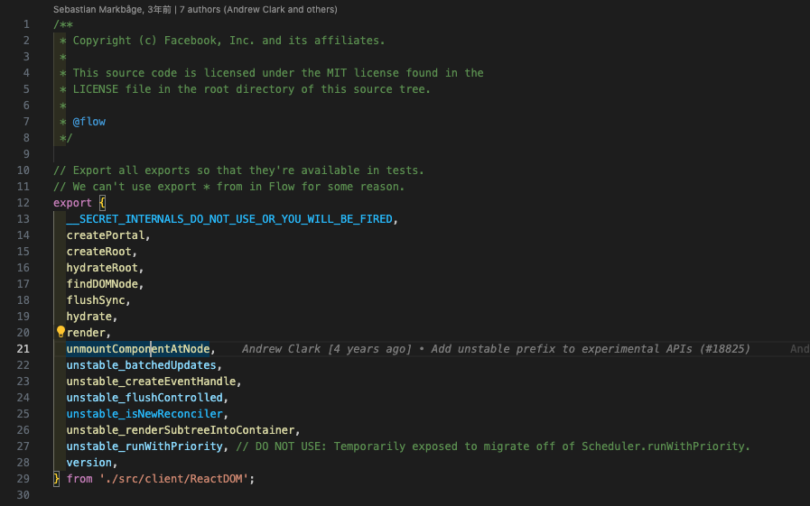

学习 React，吸收它的框架设计理念与优点。

<!-- more -->

> UI = fn(state)

---

### 核心语法

本文先只讲函数式组件，函数组件语法更短、更简单，这使得它更容易开发、理解和测试，更符合 React 的设计理念。

```javascript
function Welcome(props) {
  return <h1>Hello, {props.name}</h1>;
}
```

```javascript
const FunctionalComponent = () => {
    const [count, setCount] = React.useState(0);

    return (
        <div>
            <p>count: {count}</p >
            <button onClick={() => setCount(count + 1)}>Click</button>
        </div>
    );
};
```

```javascript
const FunctionalComponent = () => {
    useEffect(() => {
        console.log("Hello");
    }, []);

    useEffect(() => {
   	return () => {
     	    console.log("Bye");
   	};
    }, []);

    return <h1>Hello, World</h1>;
};
```

高阶组件

```javascript
class Home extends React.Component {
    render() {
        return (<h1>Hello World.</h1>);
    }
}
function withTiming(WrappedComponent) {
    return class extends WrappedComponent {
        constructor(props) {
            super(props);
            this.start = 0;
            this.end = 0;
        }
        componentWillMount() {
            super.componentWillMount && super.componentWillMount();
            this.start = Date.now();
        }
        componentDidMount() {
            super.componentDidMount && super.componentDidMount();
            this.end = Date.now();
            console.log(`${WrappedComponent.name} 组件渲染时间为 ${this.end - this.start} ms`);
        }
        render() {
            return super.render();
        }
    };
}

export default withTiming(Home);
```

React Hooks

`Hook` 是 React 16.8 的新增特性。它可以让你在不编写 `class` 的情况下使用 `state` 以及其他的 `React` 特性

useState

useEffect

useContext

useReducer

useCallback

useMemo

useRef

useImperativeHandle

useLayoutEffect

useDebugValue

**核心：`React.createElement` && `ReactDOM.render(element, container[, callback])`**

双缓存机制

### **`Firbe`架构**

Fragment

setState

react-redux

react-router


`jsx`首先会转化成 `React.createElement`这种形式，`React.createElement`作用是生成一个虚拟 `Dom`对象，然后会通过 `ReactDOM.render`进行渲染成真实 `DOM`

组件在初始化时，会通过调用生命周期中的 render 方法，生成虚拟 DOM，然后再通过调用 ReactDOM.render 方法，实现虚拟 DOM 到真实 DOM 的转换。

当组件更新时，会再次通过调用 render 方法生成新的虚拟 DOM，然后借助 diff（这是一个非常关键的算法，我将在“模块二：核心原理”重点讲解）定位出两次虚拟 DOM 的差异，从而针对发生变化的真实 DOM 作定向更新。

### [#](https://vue3js.cn/interview/React/summary.html#%E6%80%A7%E8%83%BD%E4%BC%98%E5%8C%96%E6%89%8B%E6%AE%B5%E6%9C%89%E5%93%AA%E4%BA%9B)



https://juejin.cn/post/7116141318853623839?from=search-suggest


[《React设计原理》读书分享–框架概述 - 知乎 (zhihu.com)](https://zhuanlan.zhihu.com/p/629657853)

子类是没有自己的 `this` 对象的，它只能继承父类的 `this` 对象，然后对其进行加工

而 `super()` 就是将父类中的 `this` 对象继承给子类的，没有 `super()` 子类就得不到 `this` 对象

如果先调用 `this`，再初始化 `super()`，同样是禁止的行为

在 `React` 中，类组件是基于 `ES6` 的规范实现的，继承 `React.Component`，因此如果用到 `constructor` 就必须写 `super()` 才初始化 `this`

参考文章：

[构建你自己的 React --- Build your own React (pomb.us)](https://pomb.us/build-your-own-react/)