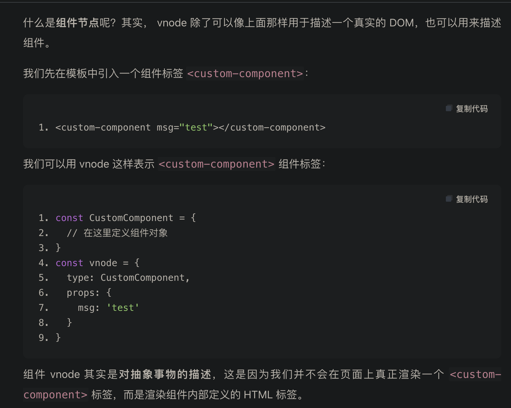

2

<!-- more -->

了解技术实现原理是前端工作的必然要求，而看源码是了解技术实现原理的最直接手法，是高效提升个人技术能力的有效途径。

```javascript
// 在 Vue.js 3.0 中，初始化一个应用的方式如下
import { createApp } from 'vue'
import App from './app'

const app = createApp(App)
app.mount('#app')

```

createApp 主要做了两件事情：创建 app 对象和重写 app.mount 方法。

`/Users/ted_lui/Desktop/code/vue-next/packages/runtime-core/src/apiCreateApp.ts`


从 app.mount 开始，才算真正进入组件渲染流程，那么接下来，我们就重点看一下核心渲染流程做的两件事情：创建 vnode 和渲染 vnode。


