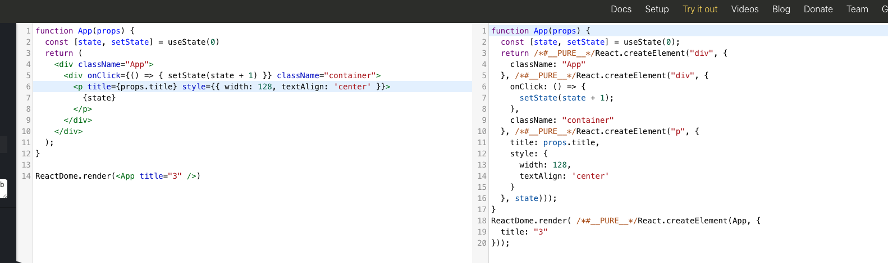
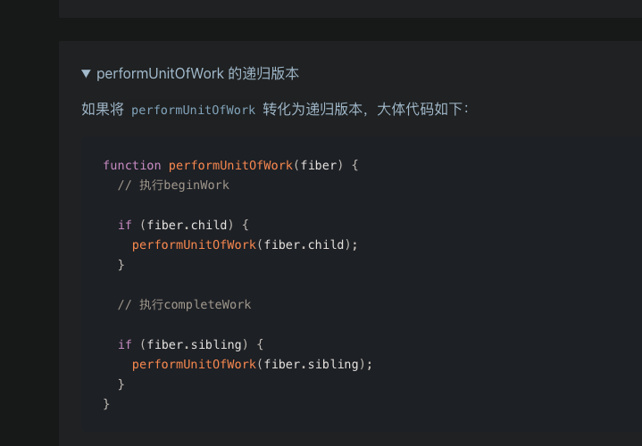

```javascript
export function createElement(type, config, children)

```

createElement 有 3 个入参，这 3 个入参囊括了 React 创建一个元素所需要知道的全部信息。

* type：用于标识节点的类型。它可以是类似“h1”“div”这样的标准 HTML 标签字符串，也可以是 React 组件类型或 React fragment 类型。
* config：以对象形式传入，组件所有的属性都会以键值对的形式存储在 config 对象中。
* children：以对象形式传入，它记录的是组件标签之间嵌套的内容，也就是所谓的“子节点”“子元素”。


```javascript

const ReactElement = function(type, key, ref, self, source, owner, props) {

  const element = {

    // REACT_ELEMENT_TYPE是一个常量，用来标识该对象是一个ReactElement

    $$typeof: REACT_ELEMENT_TYPE,


    // 内置属性赋值

    type: type,

    key: key,

    ref: ref,

    props: props,


    // 记录创造该元素的组件

    _owner: owner,

  };


  // 

  if (__DEV__) {

    // 这里是一些针对 __DEV__ 环境下的处理，对于大家理解主要逻辑意义不大，此处我直接省略掉，以免混淆视听

  }


  return element;

};

```

```javascript

ReactDOM.render(

    // 需要渲染的元素（ReactElement）

    element, 

    // 元素挂载的目标容器（一个真实DOM）

    container,

    // 回调函数，可选参数，可以用来处理渲染结束后的逻辑

    [callback]

)

```

组件在初始化时，会通过调用生命周期中的 render 方法， **生成虚拟 DOM** ，然后再通过调用 ReactDOM.render 方法，实现虚拟 DOM 到真实 DOM 的转换。

当组件更新时，会再次通过调用 render 方法 **生成新的虚拟 DOM** ，然后借助 diff（这是一个非常关键的算法，我将在“模块二：核心原理”重点讲解） **定位出两次虚拟 DOM 的差异** ，从而针对发生变化的真实 DOM 作定向更新。

文中将 render 方法形容为 React 组件的“灵魂”

React 16.3 的大图：


React 16.4 的大图


**虚拟 DOM 的优越之处在于，它能够在提供更爽、更高效的研发模式（也就是函数式的 UI 编程方式）的同时，仍然保持一个还不错的性能** 。

**因为虚拟 DOM 的劣势主要在于 JS 计算的耗时，而 DOM 操作的能耗和 JS 计算的能耗根本不在一个量级** ，极少量的 DOM 操作耗费的性能足以支撑大量的 JS 计算。

时下 React 16 乃至 React 17 都是业界公认的“当红炸子鸡”，相比之下 React 15 似乎已经是一副黯淡无光垂垂老矣的囧相了。

### 调和（Reconciliation）过程与 Diff 算法

Virtual DOM 是一种编程概念。在这个概念里，UI 以一种理想化的，或者说“虚拟的”表现形式被保存于内存中，并通过如 ReactDOM 等类库使之与“真实的” DOM 同步。这一过程叫作[协调](https://zh-hans.reactjs.org/docs/reconciliation.html)（调和）。

React 从大的板块上将源码划分为了 Core、Renderer 和 Reconciler 三部分。其中 Reconciler（调和器）的源码位于[src/renderers/shared/stack/reconciler](https://github.com/facebook/react/tree/15-stable/src/renderers/shared/stack/reconciler)这个路径，调和器所做的工作是一系列的，包括组件的挂载、卸载、更新等过程，其中更新过程涉及对 Diff 算法的调用。

因为 **Diff 确实是调和过程中最具代表性的一环** ：根据 Diff 实现形式的不同，***调和过程被划分为了以 React 15 为代表的“栈调和”以及 React 16 以来的“Fiber 调和***”。

### 异步的动机和原理——批量更新的艺术

我们首先要认知的一个问题：在 setState 调用之后，都发生了哪些事情？基于截止到现在的专栏知识储备，你可能会更倾向于站在生命周期的角度去思考这个问题，得出一个如下图所示的结论：


际的 React 运行时中，setState 异步的实现方式有点类似于 Vue 的 $nextTick 和浏览器里的 Event-Loop： **每来一个 setState，就把它塞进一个队列里“攒起来”。等时机成熟，再把“攒起来”的 state 结果做合并，最后只针对最新的 state 值走一次更新流程。这个过程，叫作“批量更新”** ，

设计思想：Fiber 是如何解决问题的

计算机科学里，我们有进程、线程之分，而 Fiber 就是比线程还要纤细的一个过程，也就是所谓的“纤程”。纤程的出现，意在对渲染过程实现更加精细的控制。

**Fiber 节点保存了组件需要更新的状态和副作用，一个 Fiber 同时也对应着一个工作单元。**

iber 架构的应用目的，按照 React 官方的说法，是实现“增量渲染”

实现增量渲染的目的，是为了实现任务的可中断、可恢复，并给不同的任务赋予不同的优先级，最终达成更加顺滑的用户体验。

在 React 16 之前，React 的渲染和更新阶段依赖的是如下图所示的两层架构：


而在 React 16 中，为了实现“可中断”和“优先级”，两层架构变成了如下图所示的三层架构：


多出来的这层架构，叫作“Scheduler（调度器）”，调度器的作用是调度更新的优先级。

在这套架构模式下，更新的处理工作流变成了这样：首先，每个更新任务都会被赋予一个优先级。当更新任务抵达调度器时，高优先级的更新任务（记为 A）会更快地被调度进 Reconciler 层；此时若有新的更新任务（记为 B）抵达调度器，调度器会检查它的优先级，若发现 B 的优先级高于当前任务 A，那么当前处于 Reconciler 层的 A 任务就会被中断，调度器会将 B 任务推入 Reconciler 层。当 B 任务完成渲染后，新一轮的调度开始，之前被中断的 A 任务将会被重新推入 Reconciler 层，继续它的渲染之旅，这便是所谓“可恢复”。

以上，便是架构层面对“可中断”“可恢复”与“优先级”三个核心概念的处理。

在 render 阶段，React 主要是在内存中做计算，明确 DOM 树的更新点；而 commit 阶段，则负责把 render 阶段生成的更新真正地执行掉。这两个阶段做的事情，非常适合和本讲刚刚讲过的 React 架构分层结合起来理解。

图中 scheduleUpdateOnFiber 方法的作用是调度更新，在由 ReactDOM.render 发起的首屏渲染这个场景下，它触发的就是 performSyncWorkOnRoot。performSyncWorkOnRoot 开启的正是我们反复强调的 render 阶段；而 commitRoot 方法开启的则是真实 DOM 的渲染过程（commit 阶段）。因此以scheduleUpdateOnFiber 和 commitRoot 两个方法为界，我们可以大致把 ReactDOM.render 的调用栈划分为三个阶段：

初始化阶段

render 阶段

commit 阶段

拆解 ReactDOM.render 调用栈——初始化阶段
首先我们提取出初始化过程中涉及的调用栈大图：


图中的方法虽然看上去又多又杂，但做的事情清清爽爽，那就是完成 Fiber 树中基本实体的创建。

什么是基本实体？基本实体有哪些？问题的答案藏在源码里，这里我为你提取了源码中的关键逻辑，首先是 legacyRenderSubtreeIntoContainer 方法。

```javascript

function legacyRenderSubtreeIntoContainer(parentComponent, children, container, forceHydrate, callback) {
  // container 对应的是我们传入的真实 DOM 对象
  var root = container._reactRootContainer;
  // 初始化 fiberRoot 对象
  var fiberRoot;
  // DOM 对象本身不存在 _reactRootContainer 属性，因此 root 为空
  if (!root) {
    // 若 root 为空，则初始化 _reactRootContainer，并将其值赋值给 root
    root = container._reactRootContainer = legacyCreateRootFromDOMContainer(container, forceHydrate);
    // legacyCreateRootFromDOMContainer 创建出的对象会有一个 _internalRoot 属性，将其赋值给 fiberRoot
    fiberRoot = root._internalRoot;

    // 这里处理的是 ReactDOM.render 入参中的回调函数，你了解即可
    if (typeof callback === 'function') {
      var originalCallback = callback;
      callback = function () {
        var instance = getPublicRootInstance(fiberRoot);
        originalCallback.call(instance);
      };
    } // Initial mount should not be batched.
    // 进入 unbatchedUpdates 方法
    unbatchedUpdates(function () {
      updateContainer(children, fiberRoot, parentComponent, callback);
    });
  } else {
    // else 逻辑处理的是非首次渲染的情况（即更新），其逻辑除了跳过了初始化工作，与楼上基本一致
    fiberRoot = root._internalRoot;
    if (typeof callback === 'function') {
      var _originalCallback = callback;
      callback = function () {
        var instance = getPublicRootInstance(fiberRoot);
        _originalCallback.call(instance);
      };
    } // Update

    updateContainer(children, fiberRoot, parentComponent, callback);
  }
  return getPublicRootInstance(fiberRoot);
}
```


React 源码中也有多处以 rootFiber 代指 current 对象，因此下文中我们将以 rootFiber 指代 current 对象。


**fiberRoot 的关联对象是真实 DOM 的容器节点；而 rootFiber 则作为虚拟 DOM 的根节点存在。这两个节点，将是后续整棵 Fiber 树构建的起点。**

！！！！！！！！！！！！！！


u**pdateContainer 的逻辑相对来说丰富了点，但大部分逻辑也是在干杂活，它做的最关键的事情可以总结为三件：**

请求当前 Fiber 节点的 lane（优先级）；

结合 lane（优先级），创建当前 Fiber 节点的 update 对象，并将其入队；

调度当前节点（rootFiber）。

performSyncWorkOnRoot直译过来就是“执行根节点的同步任务”，这里的“同步”二字需要注意，它明示了接下来即将开启的是一个同步的过程。这也正是为什么在整个渲染链路中，调度（Schedule）动作没有存在感的原因。

performSyncWorkOnRoot 是 render 阶段的起点，render 阶段的任务就是完成 Fiber 树的构建，它是整个渲染链路中最核心的一环。在异步渲染的模式下，render 阶段应该是一个可打断的异步过程（下一讲我们就将针对 render 过程作详细的逻辑拆解）。

**同步的 ReactDOM.render，异步的 ReactDOM.createRoot**

**其实在 React 16，包括近期发布的 React 17 小版本中，React 都有以下 3 种启动方式：**

**legacy 模式：
ReactDOM.render(`<App />`, rootNode)。这是当前 React App 使用的方式，当前没有计划删除本模式，但是这个模式可能不支持这些新功能。**

**blocking 模式：
ReactDOM.createBlockingRoot(rootNode).render(`<App />`)。目前正在实验中，作为迁移到 concurrent 模式的第一个步骤。**

**concurrent 模式：
ReactDOM.createRoot(rootNode).render(`<App />`)。目前在实验中，未来稳定之后，打算作为 React 的默认开发模式，这个模式开启了所有的新功能。**

其实，当前你看到的这个 render 调用链路，和 ReactDOM.render 的调用链路是非常相似的，主要的区别在 scheduleUpdateOnFiber 的这个判断里：


```javascript
function requestUpdateLane(fiber) {

  // 获取 mode 属性

  var mode = fiber.mode;

  // 结合 mode 属性判断当前的

  if ((mode & BlockingMode) === NoMode) {

    return SyncLane;

  } else if ((mode & ConcurrentMode) === NoMode) {

    return getCurrentPriorityLevel() === ImmediatePriority$1 ? SyncLane : SyncBatchedLane;

  }

  ......

  return lane;

}

```

上面代码中需要注意 fiber节点上的 mode 属性： **React 将会通过修改 mode 属性为不同的值，来标识当前处于哪个渲染模式；在执行过程中，也是通过判断这个属性，来区分不同的渲染模式** 。

因此不同的渲染模式在挂载阶段的差异，本质上来说并不是工作流的差异（其工作流涉及 初始化 → render → commit 这 3 个步骤）**，而是 mode 属性的差异。mode 属性决定着这个工作流是一气呵成（同步）的，还是分片执行（异步）的。**

### Fiber 架构一定是异步渲染吗？

之前我曾经被读者朋友问到过这样的问题： **React 16 如果没有开启 Concurrent 模式，那它还能叫 Fiber 架构吗** ？

这个问题很有意思，从动机上来看，Fiber 架构的设计确实主要是为了 Concurrent 而存在。但经过了本讲紧贴源码的讲解，相信你也能够看出，在 React 16，包括已发布的 React 17 版本中，不管是否是 Concurrent，整个数据结构层面的设计、包括贯穿整个渲染链路的处理逻辑，已经完全用 Fiber 重构了一遍。站在这个角度来看，Fiber 架构在 React 中并不能够和异步渲染画严格的等号，它是一种 **同时兼容了同步渲染与异步渲染的设计** 。

`<font color=red>`React 16 增加 Fiber 架构，此时只是为了重写虚拟 DOM，此时还是同步的，增加了 Concurrent 模式，才增加了异步操作。`</font>`


图中，performSyncWorkOnRoot 标志着 render 阶段的开始，finishSyncRender 标志着 render 阶段的结束。这中间包含了大量的 beginWork、completeWork 调用栈，正是 render 的工作内容。


实锤了，workInProgress 节点其实就是 current 节点（即 rootFiber）的副本。


**核心核心：performUnitOfWork!!!!!!!!!!!**

```javascript
function workLoopSync() {
  // workInProgress 是一个 fiber 对象
  // 它的值不为 null 意味着该 fiber 对象上仍然有更新要执行
  // while 方法支撑 render 阶段 所有 fiber 节点的构建
  while (workInProgress !== null) {
    workInProgress = performUnitOfWork(workInProgress);
  }
}
```


workLoopSync 做的事情就是通过 while 循环反复判断 workInProgress 是否为空，并在不为空的情况下针对它执行 performUnitOfWork 函数。

**而 performUnitOfWork 函数将触发对 beginWork 的调用，进而实现对新 Fiber 节点的创建。若 beginWork 所创建的 Fiber 节点不为空，则 performUniOfWork 会用这个新的 Fiber 节点来更新 workInProgress 的值，为下一次循环做准备。**

通过循环调用 performUnitOfWork 来触发 beginWork，新的 Fiber 节点就会被不断地创建。当 workInProgress 终于为空时，说明没有新的节点可以创建了，也就意味着已经完成对整棵 Fiber 树的构建。


beginWork 源码太长不看版的重点总结：

beginWork 的入参是一对用 alternate 连接起来的 workInProgress 和 current 节点；

beginWork 的核心逻辑是根据 fiber 节点（workInProgress）的 tag 属性的不同，调用不同的节点创建函数。


这里需要说明的一点是：rootFiber 作为 Fiber 树的根节点，它并没有一个确切的 ReactElement 与之映射。结合 JSX 结构来看，我们可以将其理解为是 JSX 中根组件的父节点。课时所给出的 Demo 中，组件编码如下：


reconcileChildren 函数上下文里的 workInProgress 就是 rootFiber 节点。那么此时，我们就将新创建的 App Fiber 节点和 rootFiber 关联了起来，整个 Fiber 树如下图所示：


beginWork 所触发的调用流程总结进一张大图：


共有 7 个节点，若你点击展开查看每个节点的内容，就会发现这 7 个节点其实分别是：

rootFiber（当前 Fiber 树的根节点）

App FiberNode（App 函数组件对应的节点）

class 为 App 的 DOM 元素对应的节点，其内容如下图所示


```javascript
function App() {

    return (

      <div className="App">

        <div className="container">

          <h1>我是标题</h1>

          <p>我是第一段话</p>

          <p>我是第二段话</p>

        </div>

      </div>

    );

}

```


**只有将 completeWork 和 beginWork 放在一起来看，你才能够真正理解，Fiber 架构下的“深度优先遍历”到底是怎么一回事。**


捋顺思路后，我们直接来提取知识点。关于 completeWork，你需要明白以下几件事。

（1）用一句话来总结 completeWork 的工作内容： **负责处理 Fiber 节点到 DOM 节点的映射逻辑** 。

（2）completeWork 内部有 3 个关键动作：

* **创建**DOM 节点（CreateInstance）
* 将 DOM 节点**插入**到 DOM 树中（AppendAllChildren）
* 为 DOM 节点 **设置属性** （FinalizeInitialChildren）

（3） **创建好的 DOM 节点会被赋值给 workInProgress 节点的 stateNode 属性** 。也就是说当我们想要定位一个 Fiber 对应的 DOM 节点时，访问它的 stateNode 属性就可以了。这里我们可以尝试访问运行时的 h1 节点的 stateNode 属性，结果如下图所示：


（4）将 DOM 节点插入到 DOM 树的操作是通过 appendAllChildren 函数来完成的。

说是将 DOM 节点插入到 DOM 树里去，实际上是将**子 Fiber 节点所对应的 DOM 节点**挂载到其 **父 Fiber 节点所对应的 DOM 节点里去** 。比如说在本讲 Demo 所构建出的 Fiber 树中，h1 节点的父结点是 div，那么 h1 对应的 DOM 节点就理应被挂载到 div 对应的 DOM 节点里去。


### completeUnitOfWork —— 开启收集 EffectList 的“大循环”

completeUnitOfWork 的作用是开启一个大循环，在这个大循环中，将会重复地做下面三件事：

1. **针对传入的当前节点，调用 completeWork** ，completeWork 的工作内容前面已经讲过，这一步应该是没有异议的；
2. 将 **当前节点的副作用链** （EffectList）插入到其 **父节点对应的副作用链** （EffectList）中；
3. 以当前节点为起点，循环遍历其兄弟节点及其父节点。当遍历到兄弟节点时，将 return 掉当前调用，触发兄弟节点对应的 performUnitOfWork 逻辑；而遍历到父节点时，则会直接进入下一轮循环，也就是重复 1、2 的逻辑。

步骤 1 无须多言，接下来我将为你解读步骤 2 和步骤 3 的含义。


**completeUnitOfWork 中处理兄弟节点和父节点的顺序是：先检查兄弟节点是否存在，若存在则优先处理兄弟节点；确认没有待处理的兄弟节点后，才转而处理父节点。这也就意味着 completeWork 的执行是严格自底向上的** ，子节点的 completeWork 总会先于父节点执行。


在 render 阶段，我们通过艰难的递归过程来明确“p 节点这里有一处更新”这件事情。按照 React 的设计思路，render 阶段结束后，“找不同”这件事情其实也就告一段落了。 **commit 只负责实现更新，而不负责寻找更新** ，这就意味着我们必须找到一个办法能让 commit 阶段“坐享其成”，能直接拿到 render 阶段的工作成果。而这，正是 **副作用链** （ **effectList** ）的价值所在。


effectList 链表在 Fiber 节点中是通过 firstEffect 和 lastEffect 来维护的，如下图所示：

首先、


你只需要把握住“根节点（rootFiber）上的 effectList 信息，是 commit 阶段的更新线索”这个结论，就足以将 render 阶段和 commit 阶段串联起来。


### commit 阶段工作流简析


### commit 阶段工作流简析


commit 会在 performSyncWorkOnRoot 中被调用，如下图所示：


这里的入参 root 并不是 rootFiber，而是 fiberRoot（FiberRootNode）实例。fiberRoot 的 current 节点指向 rootFiber，因此拿到 effectList 对后续的 commit 流程来说不是什么难事。

从流程上来说，commit 共分为 3 个阶段：**before mutation、mutation、layout。**

* before mutation 阶段， **这个阶段 DOM 节点还没有被渲染到界面上去** ，过程中会触发 getSnapshotBeforeUpdate，也会处理 useEffect 钩子相关的调度逻辑。
* mutation， **这个阶段负责 DOM 节点的渲染** 。在渲染过程中，会遍历 effectList，根据 flags（effectTag）的不同，执行不同的 DOM 操作。
* layout， **这个阶段处理 DOM 渲染完毕之后的收尾逻辑** 。比如调用 componentDidMount/componentDidUpdate，调用 useLayoutEffect 钩子函数的回调等。除了这些之外，它还会 **把 fiberRoot 的 current 指针指向 workInProgress Fiber 树** 。

关于 commit 阶段的实现细节，感兴趣的同学课下可以参阅 [commit 相关源码](https://github.com/facebook/react/blob/a81c02ac150233bdb5f31380d4135397fb8f4660/packages/react-reconciler/src/ReactFiberWorkLoop.new.js)，这里不再展开讨论。对于 commit，如果你只能记住一个知识点，我希望你记住 **它是一个绝对同步的过程** 。render 阶段可以同步也可以异步，但 commit 一定是同步的。

**fiber 的 diff 逻辑在 reconcileChildren 里。!!!!!!!!!!!!!!!!!!!!!!!**





### current 树 与 workInProgress 树：“双缓冲”模式在 Fiber 架构下的实现


就是 current 指针指向它的时候，此时就意味着 commit 阶段已经执行完毕，workInProgress 树变成了那棵呈现在界面上的 current 树。


会发现还是熟悉的配方，还是原来的味道。其实，挂载可以理解为一种特殊的更新，ReactDOM.render 和 setState 一样，也是一种触发更新的姿势。在 React 中，**ReactDOM.render、setState、useState 等方法都是可以触发更新的，**这些方法发起的调用链路很相似，是因为它们最后“殊途同归”，都会通过创建 update 对象来进入同一套更新工作流。


**我们已经知道 Fiber 架构下的异步渲染（即 Concurrent 模式）的核心特征分别是“时间切片”与“优先级调度”。而这两点，也正是 Scheduler 的核心能力。**

这两个函数在内部都是通过调用 unstable_scheduleCallback 方法来执行任务调度的。而 unstable_scheduleCallback 正是 Scheduler（调度器）中导出的一个核心方法，也是本讲的一个重点。


```javascript
  forceFrameRate = function(fps) {
    if (fps < 0 || fps > 125) {
      // Using console['error'] to evade Babel and ESLint
      console['error'](
        'forceFrameRate takes a positive int between 0 and 125, ' +
          'forcing framerates higher than 125 fps is not unsupported',
      );
      return;
    }
    if (fps > 0) {
      yieldInterval = Math.floor(1000 / fps);
    } else {
      // reset the framerate
      yieldInterval = 5;
    }
  };
```

现在我们来总结一下时间切片的实现原理：React 会根据浏览器的帧率，计算出时间切片的大小，并结合当前时间计算出每一个切片的到期时间。在 workLoopConcurrent 中，while 循环每次执行前，会调用 shouldYield 函数来询问当前时间切片是否到期，若已到期，则结束循环、出让主线程的控制权。


我们已经知道，无论是 scheduleSyncCallback 还是 scheduleCallback，最终都是通过调用 unstable_scheduleCallback 来发起调度的。unstable_scheduleCallback 是 Scheduler 导出的一个核心方法，它将结合任务的优先级信息为其执行不同的调度逻辑。


```javascript
// 若当前时间小于开始时间，说明该任务可延时执行(未过期）

  if (startTime > currentTime) {

    // 将未过期任务推入 "timerQueue"

    newTask.sortIndex = startTime;

    push(timerQueue, newTask);


    // 若 taskQueue 中没有可执行的任务，而当前任务又是 timerQueue 中的第一个任务

    if (peek(taskQueue) === null && newTask === peek(timerQueue)) {

      ......

          // 那么就派发一个延时任务，这个延时任务用于将过期的 task 加入 taskQueue 队列

      requestHostTimeout(handleTimeout, startTime - currentTime);

    }

  } else {

    // else 里处理的是当前时间大于 startTime 的情况，说明这个任务已过期

    newTask.sortIndex = expirationTime;

    // 过期的任务会被推入 taskQueue

    push(taskQueue, newTask);

    ......


    // 执行 taskQueue 中的任务

    requestHostCallback(flushWork);

  }

```


W3C 标准约定了一个事件的传播过程要经过以下 3 个阶段：

1. 事件捕获阶段
2. 目标阶段
3. 事件冒泡阶段

**在原生 DOM 中，事件委托（也叫事件代理）是一种重要的性能优化手段。**


像这样利用事件的冒泡特性， **把多个子元素的同一类型的监听逻辑，合并到父元素上通过一个监听函数来管理的行为，就是事件委托** 。通过事件委托，我们可以减少内存开销、简化注册步骤，大大提高开发效率。

这绝妙的事件委托，正是 React**合成事件**的灵感源泉。


对 React 来说，事件委托主要的作用应该在于帮助 React  **实现了对所有事件的中心化管控** 。


。本讲我将带你认识其中最关键的 3 个思路：

1. **使用 shouldComponentUpdate 规避冗余的更新逻辑**
2. **PureComponent + Immutable.js**
3. **React.memo 与 useMemo**

PureComponent 与 Component 的区别点，就在于它内置了对 shouldComponentUpdate 的实现：PureComponent 将会在 shouldComponentUpdate 中对组件更新前后的 props 和 state 进行 **浅比较** ，并根据浅比较的结果，决定是否需要继续更新流程。


而在第 13 ~ 16 讲的分析中，我们其实就已经在源码的各个角落见过“Lane”这个概念，也分析过一些和 Lane 相关的一些函数。初学 React 源码的同学由此可能会很自然地认为：优先级就应该是用 Lane 来处理的。但事实上，React 16 中处理优先级采用的是 expirationTime 模型。

expirationTime 模型使用 expirationTime（一个时间长度） 来描述任务的优先级；而 Lane 模型则使用二进制数来表示任务的优先级：

> lane 模型通过将不同优先级赋值给一个位，通过 31 位的位运算来操作优先级。

Lane 模型提供了一个新的优先级排序的思路，相对于 expirationTime 来说，它对优先级的处理会更细腻，能够覆盖更多的边界条件。


**React 16之前 ，reconcilation 算法实际上是递归，想要中断递归是很困难的，React 16 开始使用了循环来代替之前的递归.**


**老的 Fiber 链表（树节点）和新的 JSX 虚拟dom 节点做对比**，生成新的 Fiber 树，这个过程就是diff



